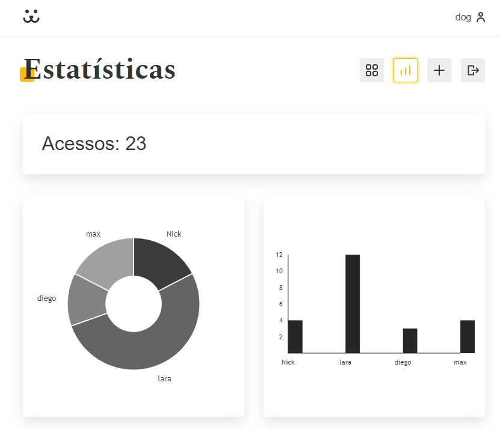

# Dogs

<h1 align="center">
   
</h1>

<a href="https://rafaelsantos499.github.io/Dogs/" target="_blank">Confira o projeto clicando aqui</a>

## 🏃‍♂️Jornada

Projeto feito, no curso de React na [Origamid](https://www.origamid.com/) .
Nesse projeto aplicamos vários conceitos do React.🚀

- [Hooks]()
- [Css Modules]()
- [React Router]()
- [PropTypes]()
- [Lazy e Suspense]()
- [Memo]()

Foi Utilizado [Victory.js](https://formidable.com/open-source/victory/) uma biblioteca de componentes React combinável usada para construir visualização e dados interativos.

Com base na quantidade de visualização das fotos.

## 🧪 Tecnologias

Esse projeto foi desenvolvido com as seguintes tecnologias:

- [React](https://reactjs.org)

## ☕ Contatos

você vai me encontrar em qualquer uma das redes sociais abaixo:

